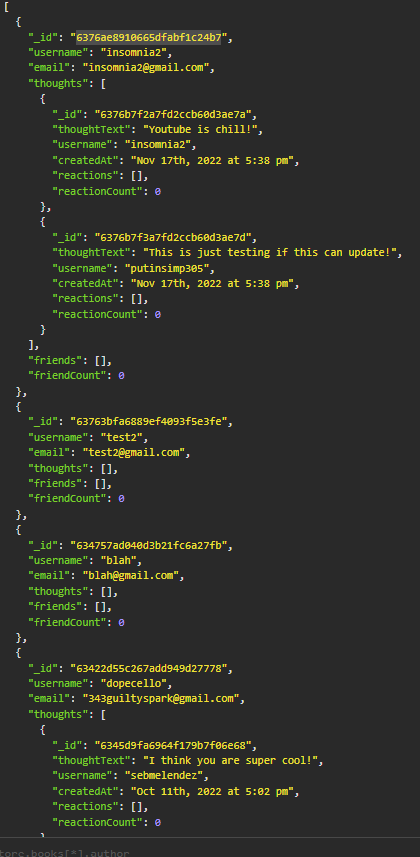

# Mongo Facebook 

## Description
This purely back-end application is a demonstration of how to make database queries in MongoDB database via Mongoose.js. Pretty simple and easy to use. Easily scalable.
## Deployed Application URL
https://youtu.be/OOgw_kSIc_A
## Screenshot

## Table of Contents
* [Features](#features)
* [Languages & Dependencies](#languagesanddependencies)
* [How to Use This Application](#HowtoUseThisApplication)
* [Contributors](#contributors)
* [Testing](#testing)
* [Questions](#questions)
## Features
Uses Insomnia
## Languages & Dependencies
mongoose, express
## How to Use This Application:
NoSQL, ES6 JavaScript
## Contributors

## Testing
N/A
## Questions
Please send your questions [here](mailto:william@fleato.com?subject=[GitHub]%20Dev%20Connect) or visit [github/dopecello](https://github.com/dopecello).
